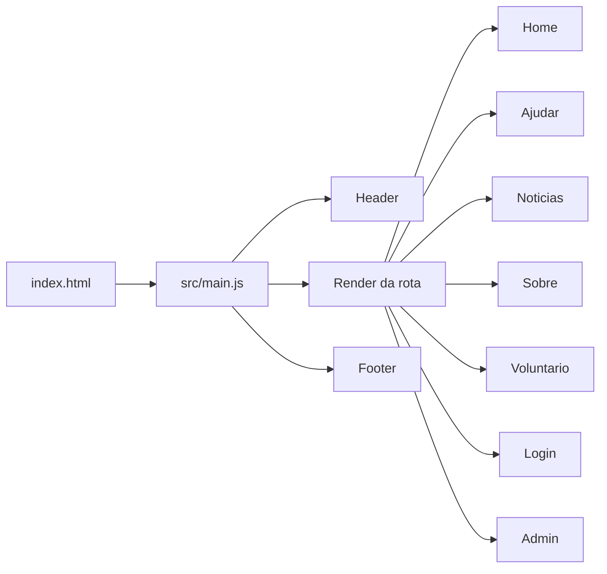
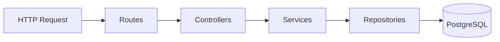

# Arquitetura do Sistema Pelu&Cia

## Visão geral

O Pelu&Cia é um sistema web dividido em duas camadas principais:

- `frontend`: SPA em Vite com JavaScript vanilla, roteamento no cliente e consumo de API por `fetch`.
- `backend`: API Node.js + Express com PostgreSQL, organizada em camadas de rota, controller, service e repository.

O sistema centraliza comunicação institucional do projeto social, notícias, contato, voluntariado e prestação de contas.

## Stack

### Frontend

- Vite
- JavaScript ES Modules
- HTML único em `index.html`
- CSS por domínio/página
- Roteamento manual com `history.pushState`

### Backend

- Node.js
- Express 5
- `pg`
- `dotenv`
- `cors`
- `nodemailer`

### Infra local

- PostgreSQL 16 em Docker
- Mailpit em Docker para capturar e-mails de desenvolvimento

## Estrutura

```txt
Pelu-Cia/
├── backend/
│   ├── app.js
│   ├── index.js
│   ├── config/
│   ├── controllers/
│   ├── database/
│   ├── middlewares/
│   ├── repositories/
│   ├── routes/
│   ├── services/
│   └── utils/
├── public/
├── src/
│   ├── css/
│   └── js/
├── docs/
├── index.html
├── package.json
└── docker-compose.yml
```

## Frontend

O frontend é uma SPA simples. `src/main.js` carrega a rota atual, monta cabeçalho e rodapé e executa o `afterRender` da página.

### Rotas

- `/` e `/index.html`: home
- `/ajudar`: doações e prestação de contas pública
- `/noticias`: notícias
- `/sobre`: apresentação institucional
- `/voluntario`: inscrição de voluntário
- `/login`: login administrativo
- `/admin` e `/admin-noticias`: painel administrativo

### Fluxo do cliente



### Páginas dinâmicas

- `home.js`: carrega notícias e envia mensagem de contato por e-mail.
- `noticias.js`: busca notícias, destaca a principal e abre modal.
- `ajudar.js`: busca configuração de doação e contas lançadas no banco.
- `voluntario.js`: envia cadastro de voluntário.
- `adminNoticias.js`: painel unificado com abas de notícias, contas, doações e voluntários.

## Backend

O backend expõe uma API REST simples.



### Bootstrap

`backend/index.js`:

1. carrega `.env`
2. chama `initDatabase()`
3. cria schema
4. aplica seed de notícias
5. sobe o servidor

`backend/app.js`:

- habilita `cors`
- habilita JSON até `5mb`
- serve `public/`
- registra rotas da API

## Rotas

### Autenticação

- `POST /api/auth/login`

Usada para obter token administrativo assinado via HMAC.

### Notícias

- `GET /api/noticias`
- `GET /api/noticias/:id`
- `POST /api/noticias`
- `PUT /api/noticias/:id`
- `DELETE /api/noticias/:id`

Leitura pública, escrita protegida por admin.

### Contas de prestação

- `GET /api/contas`
- `POST /api/contas`
- `DELETE /api/contas/:id`

Leitura pública para a página `Ajudar`, criação/exclusão protegidas por admin.

### Configuração de doação

- `GET /api/doacoes`
- `PUT /api/doacoes`

Guarda chave PIX, favorecido e dados de transferência exibidos na página pública.

### Contato

- `POST /api/contato`

Recebe nome, e-mail e mensagem da home e envia e-mail ao destinatário configurado.

### Voluntariado

- `POST /api/voluntarios`
- `POST /api/voluntarios/admin`
- `GET /api/voluntarios`
- `GET /api/voluntarios/:id`

O fluxo público salva o cadastro e dispara notificação por e-mail. O admin consegue listar e cadastrar manualmente.

## Banco de dados

### `noticias`

Armazena notícias públicas do projeto.

Campos principais:

- `titulo`
- `foto`
- `resumo`
- `noticia`
- `data`
- `tipo`
- `criado_em`

### `voluntarios`

Armazena inscrições de voluntariado.

Campos principais:

- `nome`
- `cpf`
- `email`
- `telefone`
- `idade`
- `profissao`
- `disponibilidade`
- `criado_em`

### `contas_prestacao`

Armazena entradas e saídas da prestação de contas.

Campos principais:

- `tipo`
- `descricao`
- `valor`
- `data`
- `criado_em`

### `configuracoes_doacao`

Armazena as informações exibidas na aba pública `Ajudar`.

Campos principais:

- `pix_chave`
- `pix_favorecido`
- `banco`
- `agencia`
- `conta`
- `instituicao`
- `observacao_transferencia`

## Integrações

### Notícias

O frontend consome `GET /api/noticias` e a home mostra as 3 mais recentes. A página de notícias mostra o destaque principal, lista os demais cards e abre o conteúdo completo em modal.

### Contato

A home envia a mensagem para `POST /api/contato`. O backend valida nome, e-mail e mensagem e encaminha o conteúdo por SMTP.

### Voluntariado

O formulário público envia `POST /api/voluntarios`. O backend valida CPF, idade mínima e disponibilidade. Se o SMTP estiver habilitado, a inscrição também gera e-mail de notificação.

### Prestação de contas

A aba `Ajudar` busca contas em `GET /api/contas`, calcula saldo e mostra histórico real.

### Doações

A aba `Ajudar` busca `GET /api/doacoes` para renderizar chave PIX e dados bancários. O painel admin salva essas informações em `PUT /api/doacoes`.

### Admin

O login gera token em memória do navegador via `localStorage`. O painel administrativo unificado usa esse token para publicar notícias, lançar contas, salvar dados de doação e consultar voluntários.

## E-mail e ambiente

O projeto usa `nodemailer` com variáveis de ambiente.

- `MAIL_ENABLED`
- `SMTP_HOST`
- `SMTP_PORT`
- `SMTP_SECURE`
- `SMTP_USER`
- `SMTP_PASS`
- `MAIL_FROM`
- `VOLUNTEER_NOTIFICATION_TO`
- `CONTACT_NOTIFICATION_TO`

Em desenvolvimento local, o `docker-compose.yml` expõe Mailpit como caixa SMTP de teste na porta `1025` e interface web em `8025`.

## Seed e inicialização

Ao iniciar o backend:

- as tabelas são criadas se não existirem
- notícias iniciais são inseridas sem duplicar títulos
- a configuração de doação pode ser criada/atualizada no painel admin

## Limitações atuais

- não existe upload multipart real para imagens de notícia; o admin usa `base64` no formulário atual
- a área pública de parceiros ainda é estática
- o formulário de contato envia e-mail, mas não persiste mensagens em banco
- não há módulo de adoção ou relatório financeiro avançado

## Resumo

A arquitetura atual é simples e funcional: frontend SPA, API Express em camadas e PostgreSQL como base de dados. As integrações principais já estão ligadas ao sistema real, incluindo notícias, contato, voluntariado, prestação de contas e dados de doação.
